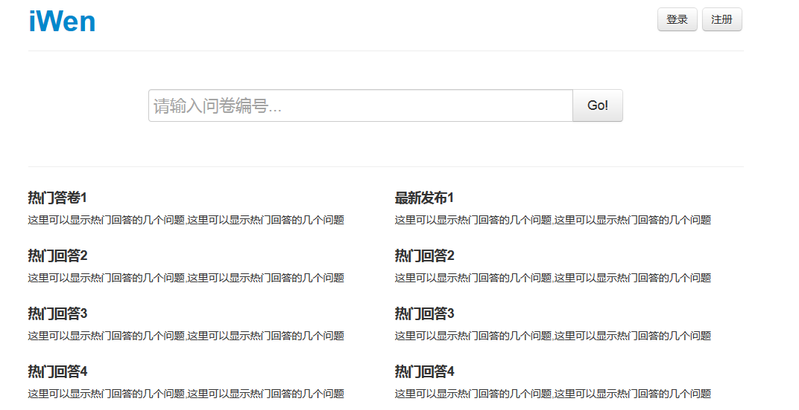
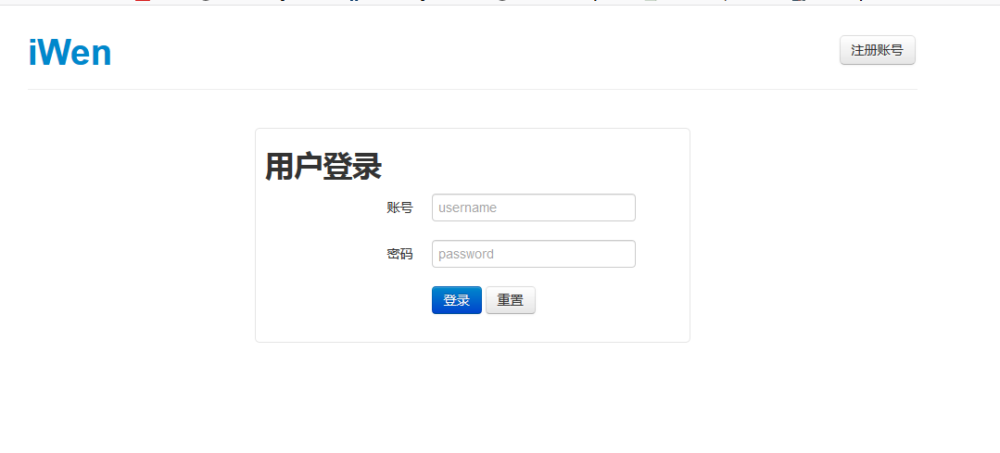
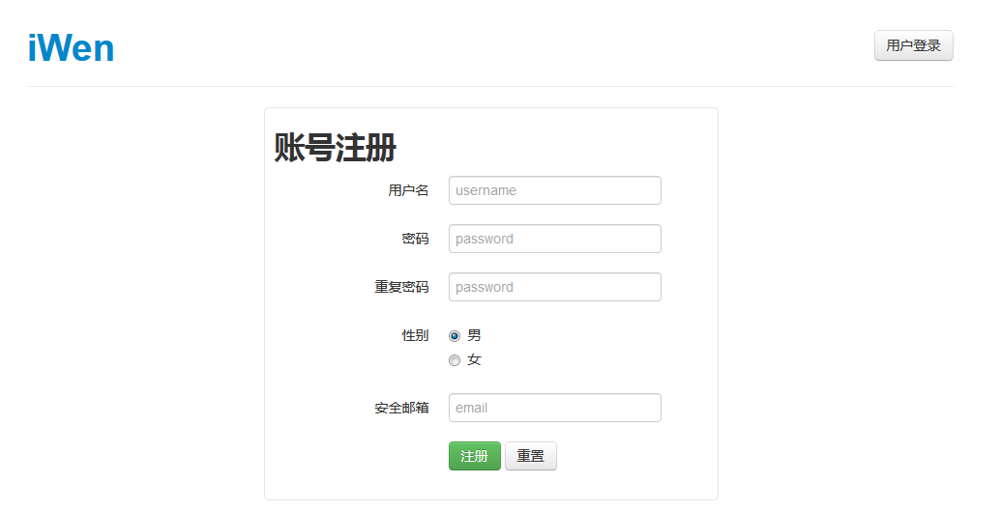

SurveySystem
============

基于Java Web的在线问卷调查系统

网站入口

登录

注册

新建db:survey
执行source sql文件恢复库表

2. 编译src下源码到web-inf class下
eclipse导入后将tomcat下的servlet-api.jar应用
修改src编译完后的路径到WEB-INF下

3. 将webroot拷贝到webapps下部署

